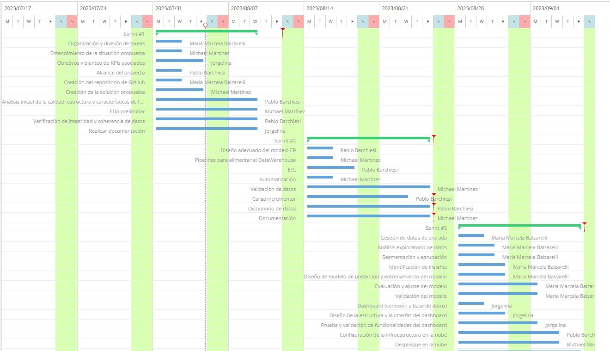

 

  

 

# Proyecto_Movilidad_Sostenible_NYC

## 1. Entendimiento de la situación propuesta: 

La empresa de servicios de transporte de pasajeros desea invertir en el sector con automóviles en la ciudad de Nueva York. Para ello, contrata a Analytica Data Solutions como Consultores externos para encontrar soluciones innovadoras, en donde se estudiará la relación entre estos medios de transporte particulares, la calidad del aire,  la contaminación sonora y correlaciones climáticas, con el objetivo de considerar la posibilidad de implementar vehículos eléctricos en su flota. Se deberá realizar un análisis preliminar del movimiento de los taxis en la ciudad para obtener un marco de referencia y tomar decisiones bien fundamentadas.

El proyecto implica recopilar, depurar y disponibilizar información relevante de diferentes fuentes para analizar la relación entre el transporte de pasajeros con automóviles en Nueva York, la calidad del aire, la contaminación sonora y correlaciones climáticas. A través de reportes, dashboards y el entrenamiento de un modelo de machine learning de clasificación, se resolverá un problema específico relacionado con los objetivos del proyecto.

## 2. Objetivos: específicos del trabajo y del grupo

### **Específicos del trabajo:**

Recopilar y depurar datos de diferentes fuentes para crear una base de datos (DataWarehouse).
Realizar un análisis exploratorio de los datos para encontrar relaciones
Crear un dashboard interactivo y visualmente atractivo que integre los resultados del análisis exploratorio de datos
Entrenar y poner en producción un modelo de machine learning de clasificación para resolver el problema de inversión en el sector.

### **Objetivos del grupo:**

Investigar y analizar los conjuntos de datos de taxis y viajes compartidos en Nueva York para identificar patrones y tendencias de movimiento.
Entender la correlación entre los datos de viajes y las métricas ambientales con el fin de proporcionar una base sólida para las decisiones futuras relacionadas con la flota de vehículos.
Proveer información relevante y confiable a la empresa para respaldar su toma de decisiones sobre la implementación de vehículos eléctricos en su flota.
Contribuir a la visión de un futuro menos contaminado y ajustarse a las tendencias de mercado actuales.

## 3.  Alcance y fuera de alcance

### **Alcance**

La recopilación, limpieza y análisis de datos de taxis y viajes compartidos para extraer información relevante.
El análisis exploratorio de datos para identificar patrones preliminares y tendencias en los datos recopilados.
La correlación entre los datos de transporte y las métricas de calidad del aire, contaminación sonora y factores climáticos.
Implementación de métricas e indicadores para evaluar diferentes aspectos del transporte de pasajeros y su relación con la contaminación ambiental y sonora.
Se requerirá la incorporación de datasets adicionales que contengan información relevante y confiable.

### **Fuera de alcance**:

La implementación real de vehículos eléctricos en la flota de la empresa. El proyecto se enfoca en proporcionar información y análisis para respaldar esta decisión, pero la implementación concreta queda bajo responsabilidad de la empresa.
Análisis exhaustivos de aspectos económicos, logísticos y regulatorios asociados con la transición a vehículos eléctricos.Análisis exhaustivos de aspectos económicos, logísticos y regulatorios asociados con la transición a vehículos eléctricos.

## KPIs: 
_**KPI 1: Tarifa del servicio de transporte.**_

Objetivo: Demostrar la ganancia neta proveniente de tarifas en relación con los costos de operación, comparando los últimos dos años.

Análisis: Evaluación económica del servicio de transporte.

_**KPI 2: Nivel de contaminación sonora de autos a combustión vs. autos eléctricos.**_

Objetivo: Indicar el nivel porcentual de ruido generado por vehículos a combustión de un año respecto a otro, destacando las ventajas de los vehículos eléctricos en términos de reducción de la contaminación sonora.

Análisis: comparar el nivel de ruido generado por vehículos a combustión y vehículos eléctricos durante el período actual.

_**KPI 3: Histórico de Emisión de CO2**_

Objetivo: Monitorear y analizar las emisiones de CO2 generadas por las operaciones de las empresas de transporte de vehículos eléctricos y de combustión en el último año en comparación con un período de referencia histórico.

Análisis: Comparar las métricas de emisiones del período actual con las del período de referencia histórico.

_**KPI 4: Precio de vehículos eléctricos vs. velocidad de carga.**_

Objetivo: Evaluar la relación entre el precio del vehículo eléctrico y la eficiencia y rapidez de su sistema de carga para comprender el valor que ofrecen en términos de carga rápida y autonomía.

Análisis: Evaluar la relación entre el precio del vehículo eléctrico y la eficiencia y rapidez de su sistema de carga para comprender el valor que ofrecen en términos de carga rápida y autonomía.

_**KPI 5: Autonomía de vehículos eléctricos vs. vehículos de combustión.**_

Objetivo: Comparar la distancia máxima recorrida por vehículos eléctricos con una carga completa de batería en comparación con vehículos de combustión utilizando un tanque completo de combustible.

Análisis: Comparar la autonomía promedio de los vehículos eléctricos con la autonomía promedio de los vehículos de combustión para cada tipo de vehículo.

## 4. Crear repositorio en Github

link: https://github.com/marcebalzarelli/Proyecto_Movilidad_Sostenible_NYC.git

## 5. Solución propuesta 

## **Stack tecnológico**

Para llevar a cabo nuestro proyecto hemos seleccionado las siguientes tecnologías:
Lenguaje de programación: Python (pandas, numpy, scikit-learn, matplotlib, seaborn)
Creación de base de datos (DataWarehouse) Microsoft Azure.
Plataforma de Colaboración: Github
Gestión de proyectos: Jira

## **Metodología de trabajo**

En este proyecto, estamos empleando la metodología ágil mediante el marco de trabajo Scrum. Esto conlleva la incorporación de los valores y conceptos ágiles en nuestro enfoque de desarrollo. Estamos aplicando la estructura definida por Scrum en términos de roles, eventos, artefactos y reglas para la organización y gestión efectiva del trabajo colaborativo.

## **Roles y responsabilidades**

- María Marcela Balzarelli - Data Science
- Pablo Nahuel Barchiesi Ponce - Data Engineer
- Michael  Martinez Chinchilla - Data Engineer
- Jorgelina Paola Lujan Ramos - Data Analyst

## **Cronograma general (Gantt)**

  

