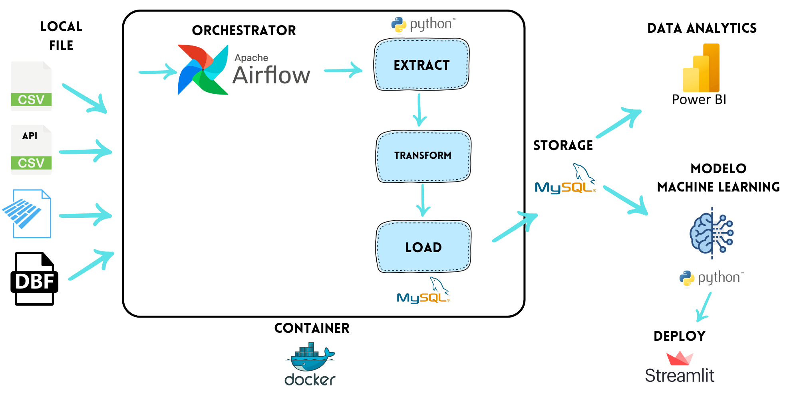

 

  

 

# Proyecto_Movilidad_Sostenible_NYC

## Entendimiento de la situación propuesta: 

La empresa de servicios de transporte de pasajeros desea invertir en el sector con automóviles en la ciudad de Nueva York. Para ello, contrata a Analytica Data Solutions como Consultores externos para encontrar soluciones innovadoras, en donde se estudiará la relación entre estos medios de transporte particulares, la calidad del aire,  la contaminación sonora y correlaciones climáticas, con el objetivo de considerar la posibilidad de implementar vehículos eléctricos en su flota. Se deberá realizar un análisis preliminar del movimiento de los taxis en la ciudad para obtener un marco de referencia y tomar decisiones bien fundamentadas.

El proyecto implica recopilar, depurar y disponibilizar información relevante de diferentes fuentes para analizar la relación entre el transporte de pasajeros con automóviles en Nueva York, la calidad del aire, la contaminación sonora y correlaciones climáticas. A través de reportes, dashboards y el entrenamiento de un modelo de machine learning de clasificación, se resolverá un problema específico relacionado con los objetivos del proyecto.

## Objetivos

- Recopilar y depurar datos de diferentes fuentes para crear una base de datos (DataWarehouse).
- Realizar un análisis exploratorio de los datos para encontrar relaciones
- Crear un dashboard interactivo y visualmente atractivo que integre los resultados del análisis exploratorio de datos
- Entrenar y poner en producción un modelo de machine learning de clasificación para resolver el problema de inversión en el sector.

## Roles y responsabilidades

- María Marcela Balzarelli - Data Science

- Pablo Nahuel Barchiesi Ponce - Data Engineer

- Michael  Martinez Chinchilla - Data Engineer

- Jorgelina Paola Lujan Ramos - Data Analyst

## **Stack tecnológico**

Para llevar a cabo nuestro proyecto hemos seleccionado las siguientes tecnologías:

- Trabajo diario: python, google meet, github.

- Ingeniería de datos: Python, mysql, Docker, Apache Airflow.

- Análisis y visualización de datos: Power Bi, python.

- Modelo de machine learning: Python.

- Gestión de proyectos: Jira

## Solución data pipeline

En esta sección se estructurará el flujo de datos desde la recepción hasta la salida del ETL.

 

  

 

### Ingesta de Datos: 

Los archivos de datos en los formatos CSV, Parquet y DBF se pueden cargar localmente al sistema. Estos archivos contienen información esencial sobre la movilidad urbana y son la base de nuestro análisis.

### Orquestación con Apache Airflow en Docker: 

Utilizamos Apache Airflow para orquestar y programar el flujo de trabajo de ingesta y procesamiento de datos. Airflow asegura que las tareas se ejecuten automáticamente y en el orden correcto, optimizando la eficiencia del sistema. Tanto Apache Airflow como los procesos ETL automatizados en Python están contenidos en contenedores Docker.

### Proceso ETL Automatizado en Python en Docker: 

El proceso de Extracción, Transformación y Carga (ETL) se realiza a través de scripts de Python contenidos en contenedores Docker. Estos scripts llevan a cabo la limpieza, transformación y enriquecimiento de los datos, preparándolos para su análisis posterior. Además, hemos implementado un mecanismo de carga incremental para actualizar los datos de manera eficiente.

### Almacenamiento en MySQL: 

Los datos procesados se almacenan en una base de datos MySQL.

### Análisis de Datos en Power BI: 

Una vez que los datos se encuentran en la base de datos, se pueden analizar y visualizar utilizando Power BI. Esto permite identificar tendencias, patrones y obtener información valiosa para la toma de decisiones informadas.

### Modelo de Machine Learning y Streamlit:

Además del análisis tradicional, estamos construyendo un modelo de Machine Learning en Python. Este modelo se implementará en una aplicación interactiva utilizando Streamlit, lo que permitirá a los usuarios interactuar con el modelo y obtener predicciones en tiempo real.

## Indicadores Clave de Desempeño (KPIs)
En este proyecto, es esencial medir el desempeño y los resultados obtenidos a través de indicadores clave. Los siguientes KPIs se utilizarán para evaluar el éxito de nuestras soluciones y el impacto de la implementación de vehículos eléctricos en la flota de transporte:

### **KPI: Crecimiento Porcentual de Tarifas de Taxi Verdes dos años**

Objetivo: Evaluar si hubo un aumento de al menos el 5% en las tarifas entre los dos últimos años.

### **KPI: Control de Incremento de Contaminación Sonora en Barrios con Mayor Contaminación**
Objetivo: Limitar el incremento anual de los niveles de contaminación sonora en los barrios identificados con mayor contaminación a un máximo del 5% durante los próximos dos años.

### **KPI: Crecimiento Anual de la Cantidad de Viajes Realizados**
Objetivo: Aumentar la cantidad de viajes realizados en un 10% anual durante los próximos cinco años.

### **KPI: Horas de Mayor Demanda en Épocas de Bajas Temperaturas**
Objetivo: Identificar las horas con la mayor cantidad de viajes realizados durante los períodos de bajas temperaturas, buscando incrementar la cantidad de viajes en esas horas en al menos un 10% en el próximo año.

